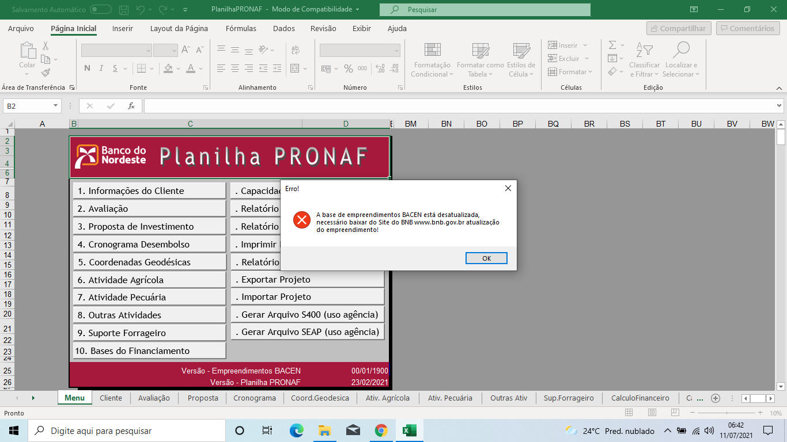
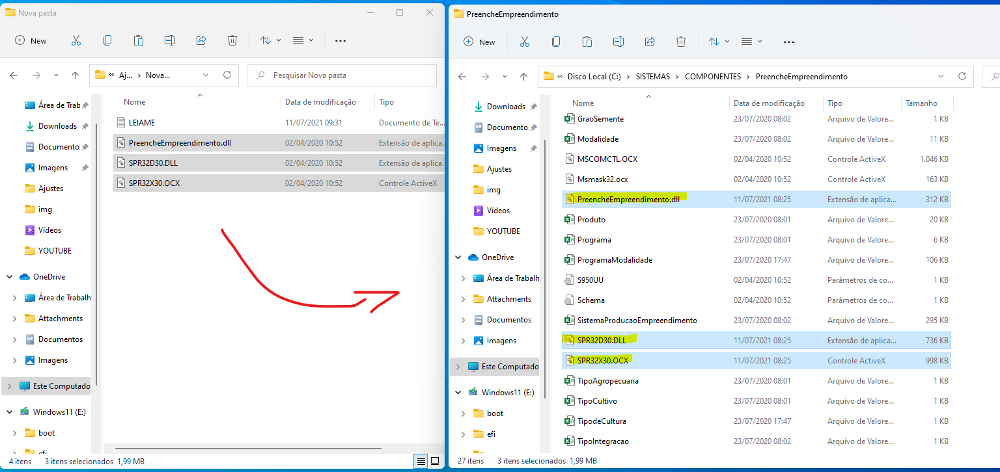
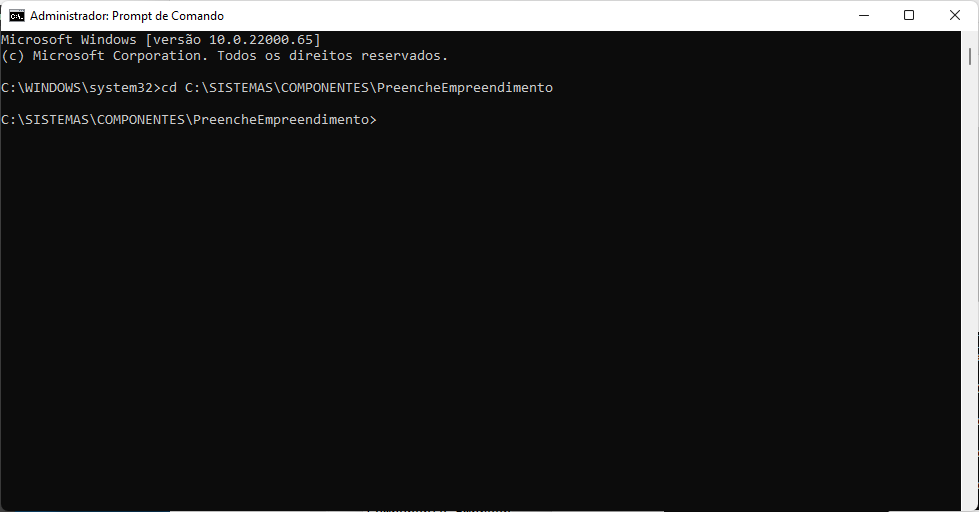
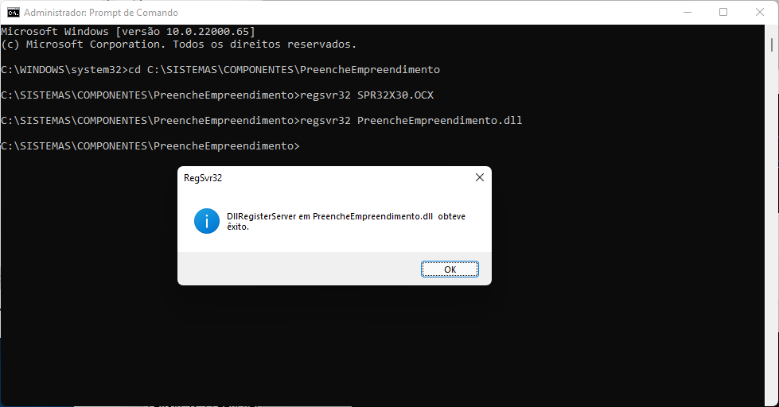
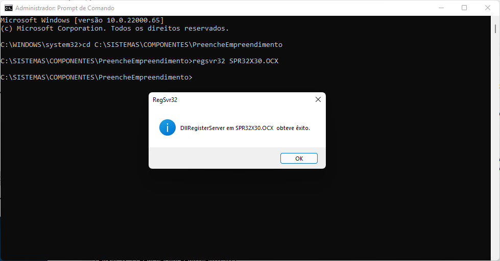

# Empreendimentos Rurais (Bacen)

O Componente Empreendimento Bacen é um programa que tem a finalidade de atualizar a tabela de empreendimentos rurais, definidos pelo Banco Central, quando da utilização dos aplicativos para elaboração de propostas (Programa SEAP ou as Planilhas de Projetos).

### ERROS COMUNS:

<h1 align="center">
  
</h1>

### NOTA: 
Utilize este aplicativo somente com o Microsoft Excel, na plataforma de 32 bits, em qualquer versão a partir do Excel 2007. 

### PRÉ-REQUISITO:
- Pacote [Office 32 bits](https://www.microsoft.com/pt-br/microsoft-365/microsoft-office) de qualquer versão apartir do Office 2007.
- Ultima versão do [Componente Empreendimento BACEN](https://www.bnb.gov.br/proposta-de-credito/aplicativos-para-elaboracao-de-propostas#fragment-0-moln) (Versão: 23/08/2022) disponivel no site BNB.gov.br.
- [Planilha Pronaf](https://www.bnb.gov.br/proposta-de-credito/aplicativos-para-elaboracao-de-propostas#fragment-0-gipn) (Versão: 03/11/2022)

### INSTALAÇÃO AUTOMATICA OU MANUAL:

*OBS: Procedimento destina-se a clientes e projetista que utilizam as planilha de projeto disponibilizada pelo Banco do Nordeste. 
Segue abaixo passos para correção de critica apresentada ao utilizar planilhas de projetos.

## LEMBRETE: Feche o programa Microsoft Excel, caso esteja com ele aberto.

### INSTALACAO AUTOMATICA:
Execute o Arquivo Corrige_TB_BACEN.bat como administrador (clique com botão direito do mouse).

OBS: o arquivo Corrige_TB_BACEN.bat faz todo o procecimento de forma automatica sem a necessidade de copia os arquivos. Caso contrario utilizar a INSTALACAO MANUAL.

### INSTALACAO MANUAL:
1. Feche o Microsoft Excel, caso estejá em execução!

2. Copie os arquivos (PreencheEmpreendimento.dll, SPR32D30.DLL e SPR32X30.OCX) para dentro do diretorio de instalação do 
Componente Empreendimento BACEN (C:\SISTEMAS\COMPONENTES\PreencheEmpreendimento), caso não tenha os arquivos ou substituir os presentes.
<h1 align="center">
  
</h1>

3. Precisamos registrar as bibliotecas que alteramos. Execulte o CMD como Administrador.

5. Clique em Iniciar, pesquise por CMD e clique com botão direito do mouse em "Execultar como Administrador".

4. Acesse o diretorio do Componente pelo comando abaixo:

<h1 align="center">
  
</h1>

```cmd
cd C:\SISTEMAS\COMPONENTES\PreencheEmpreendimento
```

5. Digite o comando abaixo e de Enter, será apresentado tela de confirmação. Clique em OK.

<h1 align="center">
  
</h1>

```cmd
regsvr32 PreencheEmpreendimento.dll
```

6. Repita o procedimento com o comando abaixo.
<h1 align="center">
  
</h1>

```cmd
regsvr32 SPR32X30.OCX
```

Pronto! com isso as planilhas de Projeto não apresentaram mais a critica.

### REGSVR32:
Regsvr32 é um utilitário de linha de comando para registrar e cancelar o registro de controles OLE, como DLLs e controles ActiveX no Registro do Windows. Regsvr32.exe está instalado na pasta %systemroot%\System32 no Windows XP e em versões posteriores do Windows. 

### TECNOLOGIAS

- [Excel - Office 365 - 32 Bits](https://www.microsoft.com/pt-br/microsoft-365/microsoft-office)
- [Componente Empreendimento BACEN](https://www.bnb.gov.br/proposta-de-credito/aplicativos-para-elaboracao-de-propostas#fragment-0-moln) (Versão: 23/08/2022)
- [Planilha Pronaf](https://www.bnb.gov.br/proposta-de-credito/aplicativos-para-elaboracao-de-propostas#fragment-0-gipn) (Versão: 03/11/2022)
- Utilitario Regsvr32


